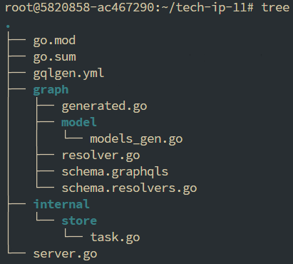
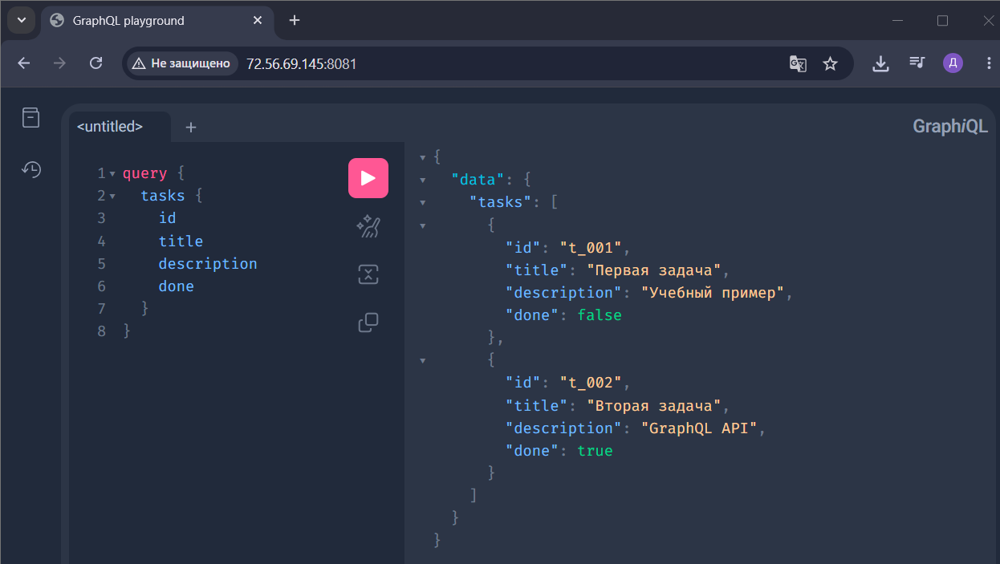
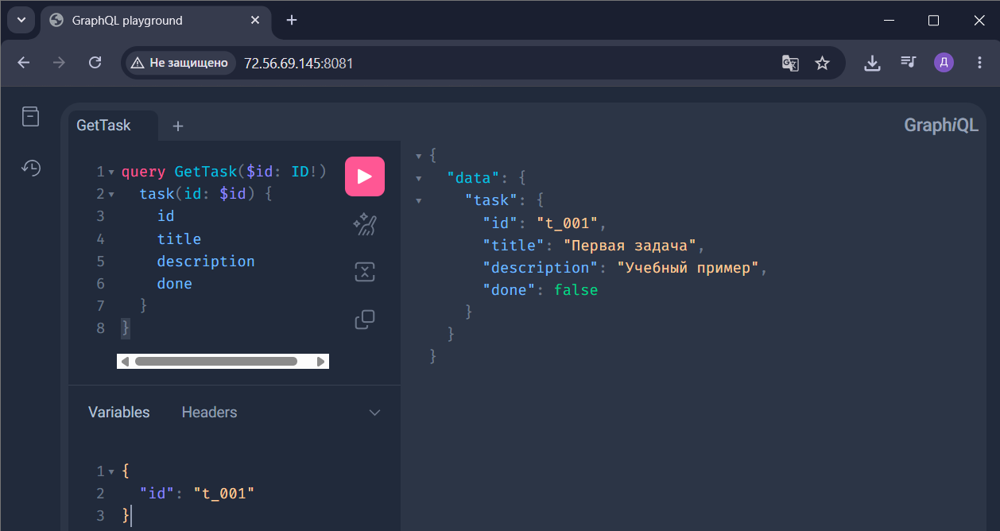
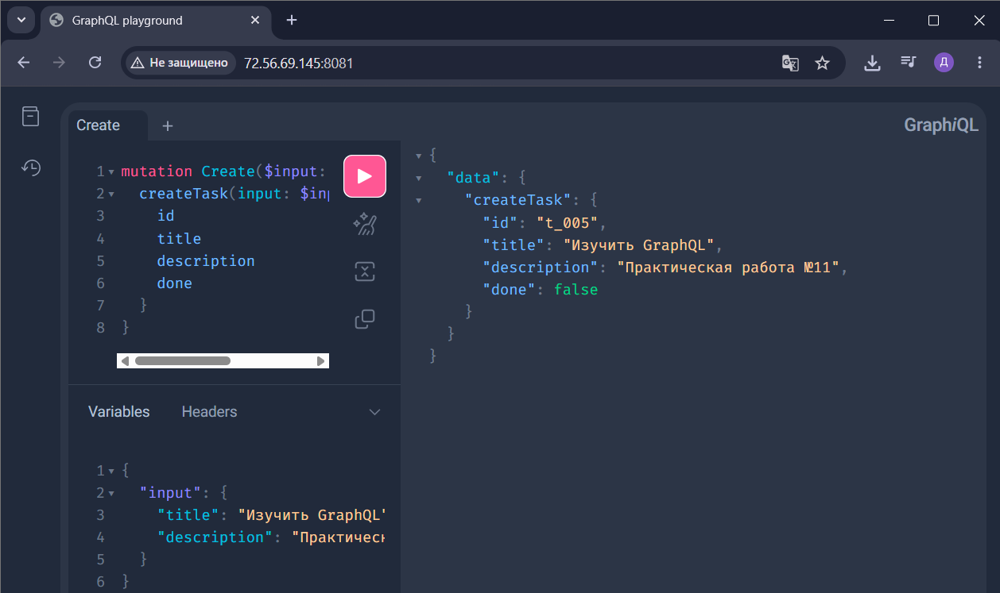
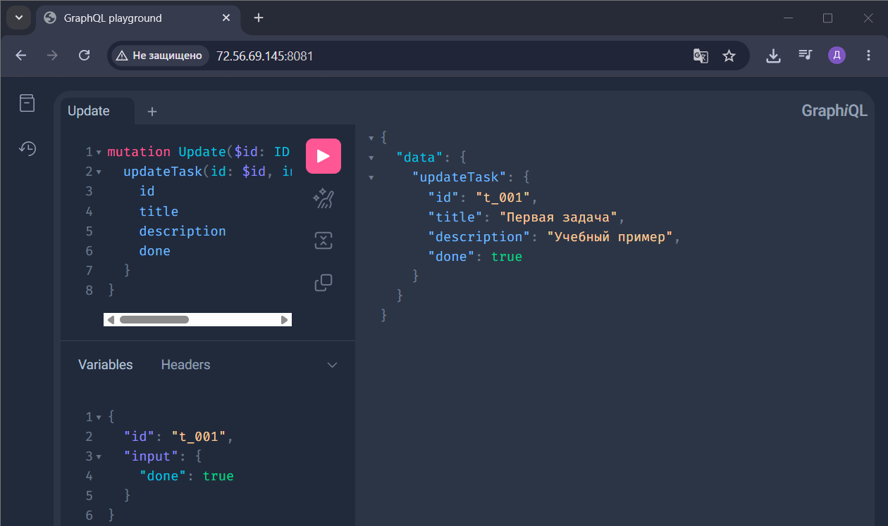
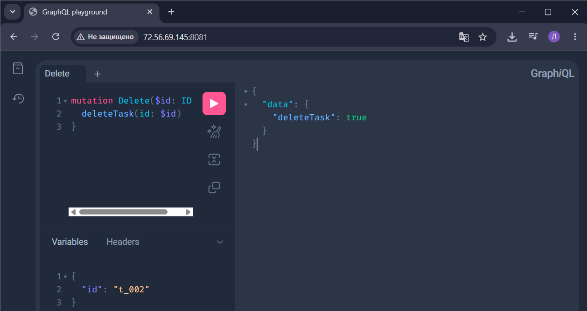

# Практическое занятие №11: GraphQL API на gqlgen

## Описание

Реализация GraphQL API для сущности `Task` с использованием библиотеки **gqlgen**.  
Поддерживаются запросы (Query) и мутации (Mutation):  
- получение списка задач  
- получение задачи по ID  
- создание задачи  
- обновление задачи (например, изменить статус `done`)  
- удаление задачи  

Хранилище – in‑memory (учебный вариант).

---

## Технологии

- **Go** 1.21+  
- **gqlgen** – генерация типобезопасного GraphQL сервера  
- **In‑memory store** – для демонстрации (без внешней БД)

---

## Структура проекта

## Примеры запросов
### 1. Получение списка задач (Query)

### 2. Получение задачи по ID

### 3. Создание задачи (Mutation)

### 4. Обновление задачи 

### 5. Удаление задачи

